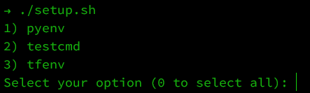
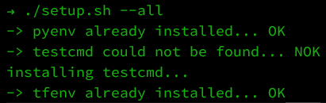

# environment-setup

A set of scripts to install tools I use in my development environment.

## tools ##

- [pyenv/pyenv](https://github.com/pyenv/pyenv)
- [tfutils/tfenv](https://github.com/tfutils/tfenv)

## how to use ##

```shell
## show selection menu
./setup.sh
```



```shell
## install all
./setup.sh --all
```

